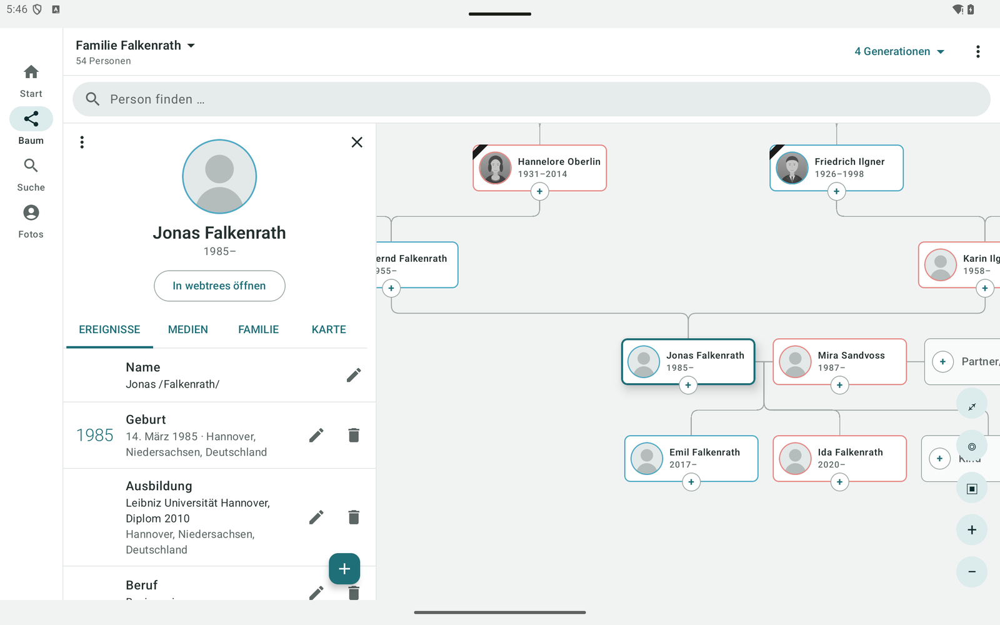
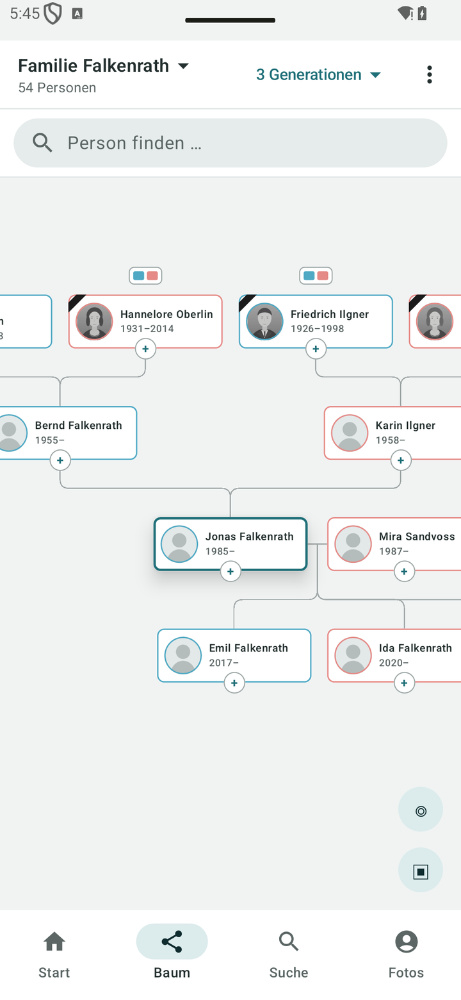

# webtreesAnd

[Deutsch](README.md) · **English**

A native Android app for [webtrees](https://webtrees.net/) – view **and edit** your family tree on phone and tablet,
with your own data on your own server.

| Tablet | Phone |
| - | - |
|  |  |

<sub>All pictures show the entirely fictional demo tree “Familie Falkenrath” (see [demo-tree/](demo-tree/)). The screenshots are in German; the app also speaks English.</sub>

## Features

- **The tree is the centre:** hourglass view with ancestors, partners, children and grandchildren; pan and zoom freely,
  expand branches upwards, make any person the focus
- **Profile:** life as a timeline (including marriage and births of children), relationship to yourself
  (“paternal grandfather”), photos, family, map of the stations of a life (OpenStreetMap)
- **Editing:** add, change and delete events – also marriages and other family events; add relatives right in the tree
  with the “+” on every card; remove links, delete individuals
- **Photos:** take or choose a picture and attach it to a person – it is shrunk to fit the server's upload limit;
  photo overview of the whole tree
- **Anniversaries:** upcoming birthdays, wedding days and days of death, with an optional daily reminder
- **Moderation:** moderators accept or reject pending changes in the app
- **Compact on phones, comprehensive on tablets**
- German and English; labels from the server arrive in the language of the app

Whatever is not native (yet) opens as the webtrees page in the same session.

## Requirement: the webtrees module

webtrees has no interface for apps. The app therefore talks to the module
**[WebtreesAnd API](https://github.com/thobgg/webtreesand-api)**, which you copy into `modules_v4/` of your own
webtrees server (2.2.x). The webtrees core stays untouched.

## Privacy

- The app signs in with your normal webtrees account. Every request runs as that user – the same privacy rules apply as
  on the website (living individuals, restricted facts, private trees).
- Changes go straight to webtrees: with “automatically accept changes” they are final, otherwise they wait for a
  moderator.
- Stored on the device: server address, user name and the session cookie – **never the password**. No cloud backup of
  the app data, no analytics, no ads, no Google services.
- Permissions: internet; notifications only if you switch on the reminder. “Take photo” needs no camera permission
  (the device's camera app takes the picture).

## Build

```bash
./gradlew :app:assembleDebug
```

`minSdk` 26, `compileSdk` 36, Kotlin and Jetpack Compose; the build needs **JDK 21**.

## License

[GPL-3.0](LICENSE), like webtrees. The demo tree in `demo-tree/` is CC0.
